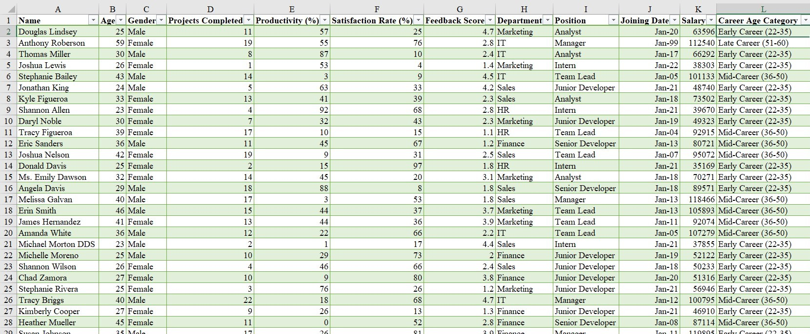
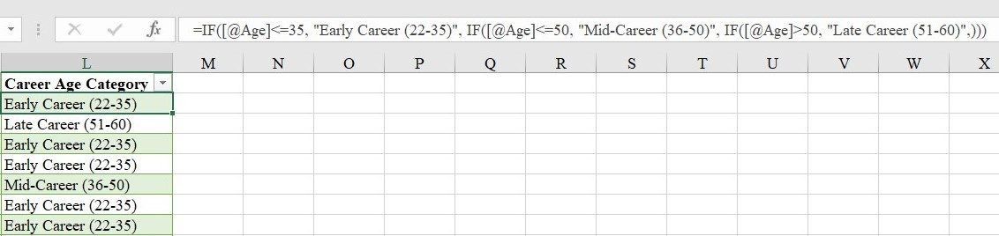
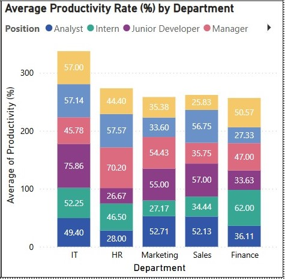
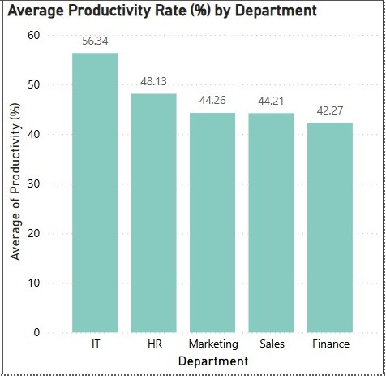
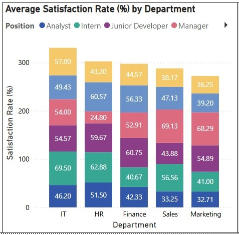
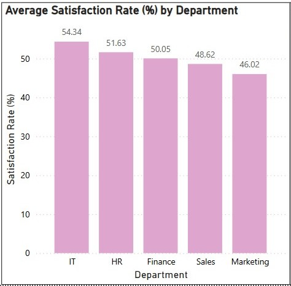
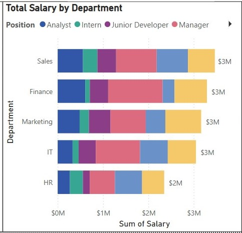
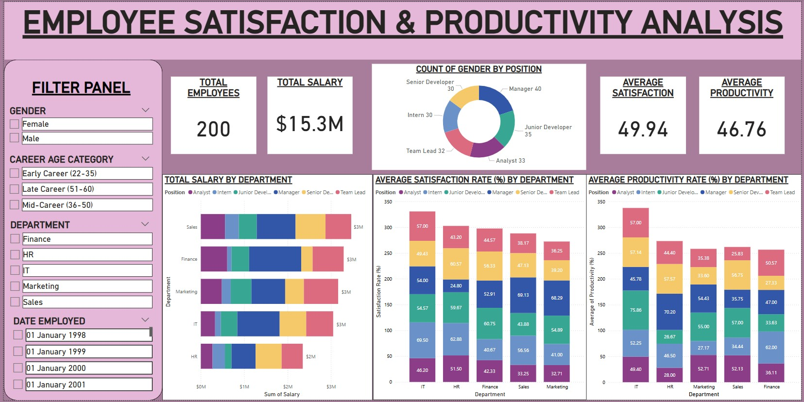

# EMPLOYEE-PRODUCTIVITY-AND-PERFORMANCE-ANALYSIS-

## PROJECT OVERVIEW

This project analyzes the relationship between employee satisfaction and productivity while exploring the impact of other variables such as salary, position, and gender.

Through this analysis, I identified the most and least productive departments, the factors driving these outcomes, and provided targeted recommendations to optimize employee performance and retention.

## DATASET INFORMATION

**Source:** Kaggle - (**hr_dashboard_data.csv**)
_This dataset explores the diverse factors impacting employee performance and satisfaction in a typical organization. It provides insights into predicting employee turnover, analyzing employee performance, and understanding the factors that influence job satisfaction._

This dataset contains 200 rows and 11 columns.

## TOOLS

For this project, I used
- Microsoft Excel for Data Cleaning and Preparation.
  - [Need this? Click to download Microsoft Excel.](https://microsoft.com)

and

- PowerBI for creating interactive visualizations and dashboards.
  - [Need this? Click to download Power BI.](https://www.microsoft.com/en-us/power-platform/products/power-bi/downloads)

## OBJECTIVES

The primary goals of this analysis are to:

1. Identify departments with the highest and lowest productivity.

2. Analyze gender distribution across different positions.

3. Evaluate the relationship between salary and employee satisfaction.

4. Assess productivity and satisfaction across career age categories.

5. Identify turnover risk areas and provide strategic recommendations.
  
## DATA CLEANING & PREPARATION

During the data cleaning and preparation phase, I took the following steps:

➜ Duplicate Removal: 

Checked for and removed duplicate values to ensure data integrity.

➜ Created a New Column – Career Age Category:

To categorize employees by age for better assessment and evaluation, I added a new column using the following formula:

=IF([@Age]<=35, "Early Career (22-35)", 

   IF([@Age]<=50, "Mid-Career (36-50)", 
   
   IF([@Age]>50, "Late Career (51-60)", "")))

  
➜ Standardization: 

Standardized font size and data types for consistency and improved data handling.

## VISUALIZATIONS & DASHBOARDS

### **KEY CHARTS (1):**
A. **Average Productivity Rate:**

WITH POSITIONS IN EACH DEPARTMENT                                                   |  WITHOUT POSITIONS           
:---------------------------------------------------------------------------------: | :---------------------------------------------------------------------------------------:
                                                   |   

### **Key Findings & Insights:**

1. Most Productive Department:

   - **IT (56.34%)**

2. Least Productive Department:

   - **Finance (42.27%)**

3. Most Productive Position:

   - **Junior Developers (IT) (75.86%)**

4. Least Productive Position:

   - **Team Leads (Sales) (25.83%)**

     
---

### **KEY CHARTS (2):**
B. **Average Satisfaction Rate:**

WITH POSITIONS IN EACH DEPARTMENT                                                   |  WITHOUT POSITIONS  
:---------------------------------------------------------------------------------: | :---------------------------------------------------------------------------------------:
                                                   |  

### **Key Findings & Insights:**

1. Most Satisfied Department:

   - **IT (54.34%)**

2. Least Satisfied Department:

   - **Marketing (46.02%)**

3. Most Satisfied Position:

   - **Interns (IT) (69.50%)**

4. Least Satisfied Position:

   - **Managers (HR) (24.80%)**

---

### **KEY CHARTS (3):**
C. **Salary of Employees:**

### **Key Findings & Insights:**

1. Highest-Paid Department:

   - **Sales ($3,466,596)**

2. Lowest-Paid Department::

   - **HR ($2,349,502)**

3. Highest-Paid Position:

   - **Managers (Finance) ($1,200,732)**

4. Lowest-Paid Position:

   - **Interns (Finance) ($100,838)**

5. Total Salary Expenditure:

   - **$15,323,849**

---

### **KEY CHARTS (4):**
D. **Full Analysis:**

### **Key Findings & Insights:**

1. The total number of employees:
   - **200**.
     
3. The average productivity rate of all staff:
   - **46.76%.**
     
5. The average satisfaction rate of all staff:
   - **49.94%.**
     
7. The total salary of all employees during the period under review:
   - **$15,323,849.**

## EXPLORATORY DATA ANALYSIS

**GENDER-BASED INSIGHTS:**

1. Because there are 100 Male and 100 Female employees,

   ➜ the organization maintains equal gender representation.
   This is the distribution below:
   
   For FEMALES:
   
    POSITIONS                                      | COUNT OF GENDER
   :-----------------------------------------------|--------------------------------------------:
   Managers                                        |   22
   Junior Developers                               |   19
   Teamleads                                       |   18
   Interns                                         |   15
   Senior Developers                               |   14
   Analysts                                        |   12
   **TOTAL**                                       |   **100**

    For MALES:
   
     POSITIONS                                     | COUNT OF GENDER
   :-----------------------------------------------|--------------------------------------------:
   Analysts                                        |   21
   Managers                                        |   18
   Senior Developers                               |   16
   Junior Developers                               |   16
   Interns                                         |   15
   Teamleads                                       |   14
    **TOTAL**                                      |   **100**

2. Female employees report higher job satisfaction **(51.25%)** than Male employees **(48.62%)**,

   ➜ thus, Females are more satisfied with their jobs.

3. But Male employees have higher productivity **(50.54%)** compared to Female employees **(42.97%)**,

   ➜ hence, Males are more productive despite being less satisfied.

4. Female employees earn **$7,698,522**, slightly more than Male employees who earn **$7,625,327**,

   ➜ Females receive a higher total salary.

5. Because Female employees in the **Marketing** department earn the most **($1,878,309)** but have the lowest satisfaction **(41.58%)** and average productivity **(42.54%)**,

   ➜ there may be a pay-satisfaction gap or uncondusive working conditions.

6. Male employees in the **Finance** department earn **$1,841,536** (the highest among males) but show low productivity **(41.08%)** despite high satisfaction **(52.13%)**,

   ➜ Meaning that, higher pay in Finance does not necessarily increase productivity.

----

**BASED ON DEPARTMENTS:**

1. Given that the Sales department earns **$3,466,596**,

   ➜ it is the highest-paid department.

3. The Finance department earns **$3,292,103** but has the lowest productivity **(42.27%)**,

   ➜ higher pay does not guarantee higher productivity.

3. Given that the Marketing department earns **$3,165,202** but reports the lowest satisfaction **(46.02%)**,

   ➜ employee satisfaction may not align with salary.

5. With the IT department earning **$3,050,446** while maintaining the highest satisfaction **(54.34%)** and highest productivity **(56.34%)**,

   ➜ IT emerges as the most efficient and satisfied workforce.

5. The HR department earns **$2,349,502**,

   ➜ making it the lowest-paid department.

---

**BASED ON CAREER AGE CATEGORY:**

1. Highest productive age group:
   - **Late Career 53.47%** (Ages 51-60, made up of only Managers).

2. Lowest productive age group:
   - **Mid Career 43.81%** (Ages 36-50, with only Teamleads, Senior Developers and Managers).

3. Highest satisfied age group:
   - **Late Career 53.71%**

4. Lowest satisfied age group:
   - **Early Career 48.56%** (Ages 22-35, having all positions).

## COMPREHENSIVE PREDICTIONS, TURNOVER RISKS, AND RECOMMENDATIONS.

### HIGH TURNOVER RISK AREAS
   
### 1. Marketing Department

**Prediction:** Marketing has the highest turnover risk due to poor satisfaction and a possible misalignment between pay and work conditions.

➜ Reason 1: It has the lowest satisfaction rate (46.02%), meaning employees may feel disengaged or unhappy.

➜ Reason 2: Despite receiving $3.1M in total salary, dissatisfaction suggests that higher pay is not compensating for potential job-related stress.

➜ Reason 3: Positions like Interns (41.00%) and Analysts (32.71%) in low-satisfaction environments and relatively lower pay compared to other positions often have higher burnout rates.

✅ **Recommendations:**

1. Link Pay to Performance ➜ Implement performance-based bonuses.

2. Support Career Growth ➜ Offer clear promotion pathways for Analysts and Interns.

3. Reduce Workload Stress ➜ Introduce flexible work options and mental health support.

4. Engage Employees ➜ Conduct regular feedback sessions to address dissatisfaction.

---

### 2. Finance Department

**Prediction:** Moderate-to-high turnover risk, particularly for Interns and Senior Developers who face low productivity, low satisfaction and low salries.

➜ Reason 1: It has the lowest productivity rate (42.27%), especially among Senior Developer (27.33%), reflecting potential disengagement.

➜ Reason 2: Managers in Finance earn the most across all positions (~$1.2M), which could cause dissatisfaction and friction and cause turnover in lower-earning roles (e.g., Interns at ~$100K and  Senior Developers at ~$261k).

✅ **Recommendation:**

1. Upskill & Train ➜ Provide professional development for low-performing roles (e.g., Senior Developers).

2. Balance Pay Structure ➜ Adjust pay gaps between high- and low-earning roles.

3. Enhance Work Conditions ➜ Improve job clarity and offer more collaborative projects.

4. Mentorship Programs ➜ Pair interns and junior staff with senior leaders for growth.

---

### 3. Sales Department

**Prediction:** Sales has a moderate-to-high turnover risk, particularly among Team Leads and Managers who underperform despite higher pay.

➜ Reason 1: It receives the highest salary (~$3.5M) but shows below-average productivity (44.21%), signaling potential overcompensation or job fatigue.

➜ Reason 2: Team Leads exhibit the lowest productivity (25.83%), despite higher pay compared to others. This suggests burnout or a misalignment of expectations, making them a key group likely to leave.

➜ Reason 3: Managers earn the highest (~$894K) and show high satisfaction but very low productivity. this could indicate Complacency, Role Ambiguity (they may focus on admin tasks, not driving sales, Incentive Misalignment (that is, if High pay is not tied to performance which would reducece motivation).

✅ **Recommendations:**

1. Revise Incentives ➜ Link manager and team lead bonuses to tangible sales outcomes.

2. Clarify Roles ➜ Reduce admin tasks for managers to focus on core responsibilities.

3. Monitor Workload ➜ Prevent burnout by redistributing tasks for low-performing leads.

4. Enforce Accountability ➜ Implement regular performance reviews and improvement plans.

---

### LOW TURNOVER RISK AREAS

### 4. IT Department

**Prediction:** Lowest turnover risk due to highest satisfaction (54.34%) and highest productivity (56.34%).

➜ Reason 1: It has the highest satisfaction (46.20% - 69.50%) and productivity (49.40% - 75.86%), particularly among Interns and Managers.

➜ Reason 2: Balanced salary distribution and positive work culture contribute to higher retention.

✅ **Recommendation:**

1. Increase Pay for Analysts & Interns: Despite high productivity, their salaries are relatively lower—adjust to reward performance.

2. Encourage Innovation: Introduce new projects to maintain their high engagement and keep the team challenged.

3. Maintain Work-Life Balance: Prevent burnout by offering flexible hours or remote work options.

---

### 5. HR Department

**Prediction:** Lowest paid department with 2nd place highest satisfaction and prodictivity could lead to Low-to-moderate turnover risk.

➜ Reason 1: Moderate satisfaction (51.63%) and productivity (48.13%) suggest steady engagement.

➜ Reason 2: Interns (28.00%) and Junior Developers (26.67) show lower productivity but higher satisfaction, indicating room for skill development.

➜ Reason 3: Managers, despite higher salary and high productivity, report low satisfaction, indicating

➜ Junior Developers earn the least (~$151K).

✅ **Recommendations:**

1. Upskill Junior Staff ➜ Provide training programs to boost productivity for Interns and Junior Developers.
   
2. Increase Junior Pay ➜ Adjust Junior Developers, Interns and Analysts salaries to align with other departments.

3. Address Manager Dissatisfaction ➜ Conduct one-on-one regular check-ins to identify and resolve pain points.

4. Career Growth ➜ Offer clear promotion pathways to retain satisfied but low-performing roles.

5. Recognize High Performers ➜ Reward productivity to maintain engagement and reduce turnover.

---

### GENDER-BASED PREDICTIONS:

1. Higher Female Satisfaction Could Lead to Lower Female Turnover:

   ➜ Since female employees report higher satisfaction (51.25%) than males (48.62%), they are less likely to leave the organization.

2. Male Productivity Advantage May Lead to Higher Workload:

   ➜ Male employees show higher productivity (50.54%), which could increase burnout risk if workloads remain imbalanced.

3. Salary Discrepancy Might Cause Retention Issues for Males:

   ➜ Females earn $73,195 more in total than males—this pay gap could cause dissatisfaction among male employees over time.

## CONCLUSION

Based on the analysis, it is clear that addressing key areas of employee satisfaction, productivity, and compensation will significantly reduce turnover risks and enhance overall engagement. To maintain a balanced and motivated workforce, I recommend the following strategic actions:

**1. Link Pay to Performance:**
  
   Aligning compensation with measurable outcomes will ensure that high-performing employees feel recognized while reducing the risk of overcompensating low performers. This is especially critical in departments like Sales and Finance, where higher pay does not currently translate to higher productivity.

**2. Address Salary Discrepancies:**

   While the organization offers competitive salaries, there are noticeable pay gaps between different roles and gender groups. It is important to adjust these discrepancies—particularly in Finance and HR—to prevent dissatisfaction and ensure equitable compensation across all positions.

**3. Invest in Career Growth Opportunities:**
   
   Providing clear career pathways and skill development programs is essential, particularly for early-career employees and lower-performing groups like Interns, Analysts, and Junior Developers. This not only boosts productivity but also increases long-term retention by giving employees a sense of progress and purpose.

**4. Manage Workload and Prevent Burnout:**

   Departments showing high productivity but low satisfaction—such as Finance and Sales—may face burnout risks. Regularly reviewing workloads, offering flexible work options, and promoting a supportive work environment will help sustain performance without compromising well-being.

**5. Sustain Positive Work Environments in High-Performing Areas:**

   The IT department demonstrates both high satisfaction and productivity. Maintaining this positive culture through continued support, innovation incentives, and work-life balance initiatives will ensure these strengths are preserved while serving as a model for other departments.

By implementing these strategies, the organization can effectively reduce turnover risks, improve employee satisfaction, and maintain a productive, engaged workforce across all levels.

## CONTACT ME

E-mail: portiareginald06@gmail.com

LinkedIn: [Portia Reginald Anrulika](https://www.linkedin.com/in/portia-reginald-13103719a?utm_source=share&utm_campaign=share_via&utm_content=profile&utm_medium=android_app)
